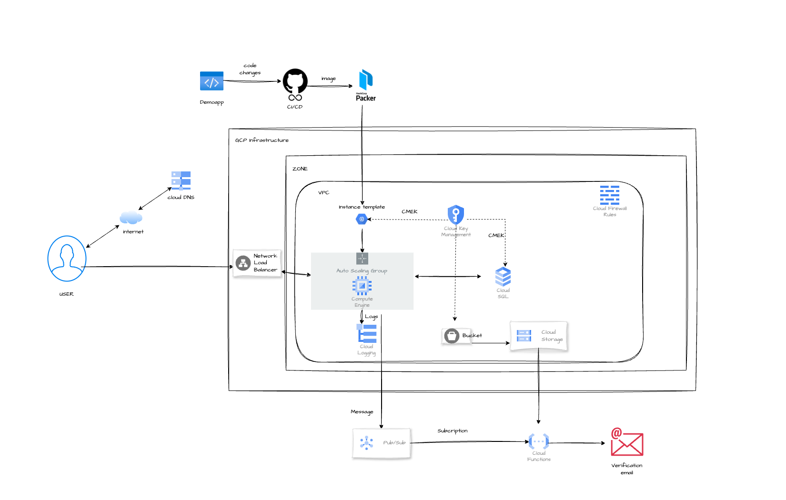

# Email Verification App Infrastructure

This Terraform configuration sets up the infrastructure for an email verification application on Google Cloud Platform (GCP). The setup includes a Virtual Private Cloud (VPC), Compute Engine instances, Cloud SQL database, Cloud Functions, and various supporting services.

## Infrastructure Components

### Networking
- **Custom VPC** with separate subnets for web application and database
- **VPC Access Connector** for serverless services
- **Firewall Rules** to allow internet traffic and deny SSH access

### Compute
- **Managed Instance Group** with autoscaling for the web application
- **Instance Template** with startup script to configure the application

### Database
- **Cloud SQL Instance** (MySQL 8.0) with private IP configuration
- **Database and User Creation**

### Storage
- **Cloud Storage Bucket** for serverless function code
- **Object Storage** for the application archive

### Serverless
- **Cloud Function** triggered by Pub/Sub events for email processing

### Security
- **Cloud KMS** for encryption of VM disks, SQL instance, and storage
- **Service Accounts** with least privilege access

### Load Balancing
- **Global Load Balancer** with HTTPS support
- **Managed SSL Certificate**
- **Health Checks** for backend instances

### DNS
- **DNS A Record** for the application domain

## Key Features

- **Encryption**: Uses Cloud KMS to encrypt VM disks, SQL instance, and storage bucket
- **Private Networking**: SQL instance and Cloud Function use private VPC networking
- **Autoscaling**: Compute Engine instances autoscale based on CPU utilization
- **High Availability**: Load balancing and regional instance groups for improved reliability
- **Secure Communication**: HTTPS load balancer with managed SSL certificate

## Usage

1. Ensure you have the necessary GCP credentials and permissions.
2. Update the variables in a `terraform.tfvars` file or through environment variables.
3. Run `terraform init` to initialize the Terraform working directory.
4. Run `terraform plan` to preview the changes.
5. Run `terraform apply` to create the infrastructure.

## Important Notes

- The SQL instance has deletion protection enabled by default.
- Ensure all required APIs are enabled in your GCP project.
- Review and adjust the machine types, disk sizes, and other parameters as needed for your specific use case.
- The startup script for the Compute Engine instances sets up environment variables for the application.

## Security Considerations

- SSH access is denied by default through a firewall rule.
- All services use service accounts with specific, limited permissions.
- Sensitive data is stored in Cloud SQL and accessed securely by the application.

## Monitoring and Cleanup

- Monitor your resources and costs to ensure efficient usage.
- Destroy the infrastructure with `terraform destroy` when no longer needed.
